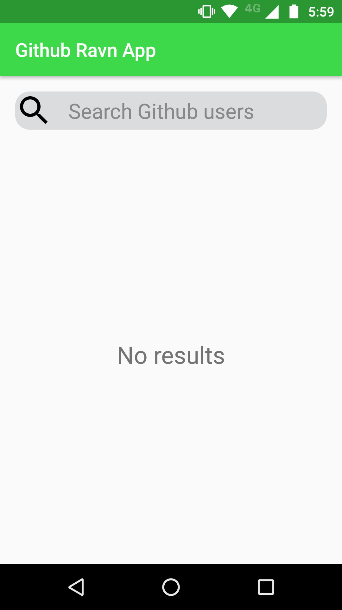
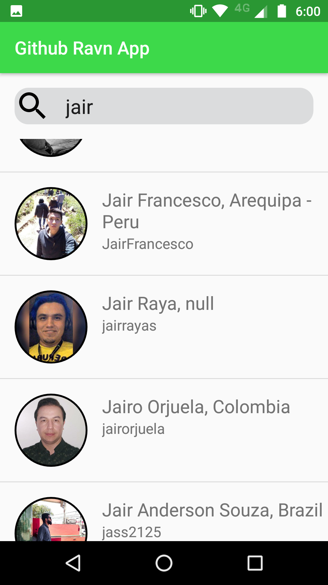
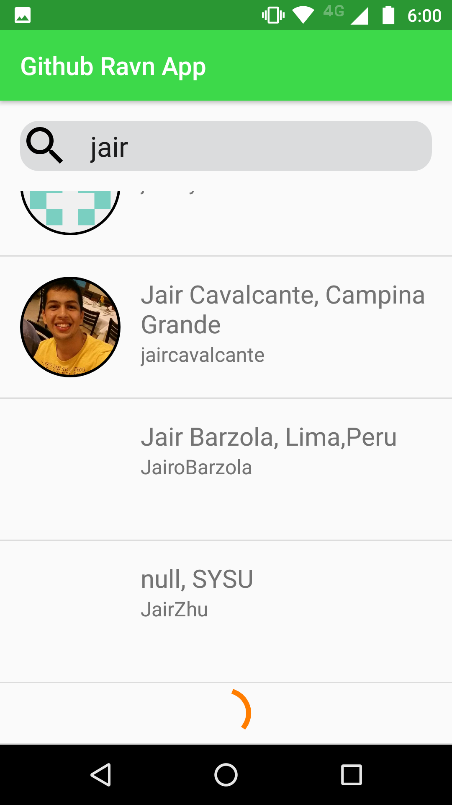
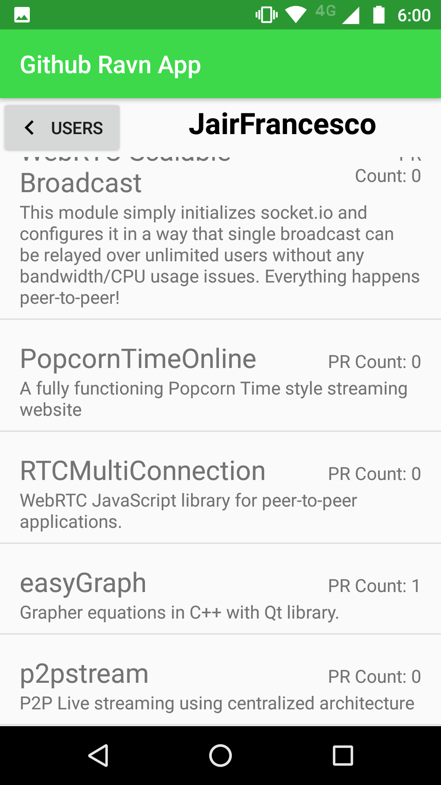

# RAVNGraphQL
RAVN GraphQL Code Challenge

## Programming environment
1. Language programming: Kotlin
2. IDE: Android Studio 3.5.1

# Instructions to running the App
## Add a github api token
1. To add the github api token to the project go to gradle.properties on the project directory
2. Append the following line to the end of the file.

```
github_ApiKey="YOUR API KEY"

```
# Screenshots


| Home (Empty state)   | User Search | Load More Users (Pagination) | User's Repositories |
| ------------- | ------------- | ------------- | ------------- | 
|  |   |  |  |

